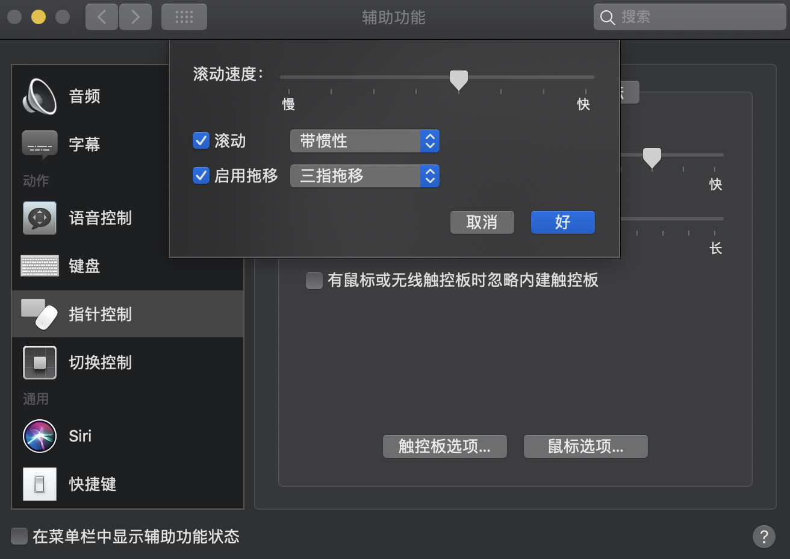

# mac os 配置记录


1. 安装typora，一款不错的markdown编辑器 https://www.typora.io

2. 安装搜狗输入法，https://pinyin.sogou.com/mac/

3. 安装google浏览器， https://www.google.cn/intl/zh-CN/chrome/thank-you.html?statcb=0&installdataindex=empty&defaultbrowser=0 ；同步账号

4. *系统偏好设置* -> *触控板* -> *轻点来点按* 

   

5. *系统偏好设置* -> *辅助功能* -> *指针控制* -> *触控板选项*

   

6. 安装sublime, http://www.sublimetext.com/

7. 解决github缓慢问题

   ```shell
   # https://www.ipaddress.com/ # 有梯子就不要改了
   # github 
   199.232.69.194  github.global.ssl.fastly.net
   140.82.113.3    github.com
   
   sudo vim /etc/hosts
   sudo dscacheutil -flushcache # 刷新dns缓存 
   ```

8. 安装ohmyzsh

   ```shell
   ssh-keygen  # 一路回车
   cat ~/.ssh/id_rsa.pub  # 配置到github账号ssh keys
   git clone git@github.com:ohmyzsh/ohmyzsh.git
   sh ~/ohmyzsh/tools/install.sh
   ```

9. 安装brew

   优先参考 [Homebrew安装2020年4月最新](https://blog.csdn.net/Jack_Bin0312/article/details/105746634?utm_medium=distribute.pc_relevant_t0.none-task-blog-BlogCommendFromMachineLearnPai2-1.channel_param&depth_1-utm_source=distribute.pc_relevant_t0.none-task-blog-BlogCommendFromMachineLearnPai2-1.channel_param)

   ```shell
      # 安装
      git@github.com:Homebrew/install.git
      cd install
      vim install.sh  # 替换 BREW_REPO="https://mirrors.ustc.edu.cn/brew.git"
      sh install.sh
      
      # 换源
      cd "$(brew --repo)/Library/Taps/homebrew/homebrew-core"
      git remote set-url origin https://mirrors.ustc.edu.cn/homebrew-core.git
      
      cd "$(brew --repo)"
      git remote set-url origin https://mirrors.ustc.edu.cn/brew.git
      
      echo 'export HOMEBREW_BOTTLE_DOMAIN=https://mirrors.ustc.edu.cn/homebrew-bottles' >> ~/.zshrc
      brew update
      
      brew install wget
      brew install aria2  # 下载工具 
   ```

10. Apple Store 安装SSH工具termius 

11. Apple Store 安装网易云音乐

12. Anaconda

    ```shell
    https://mirrors.tuna.tsinghua.edu.cn/anaconda/archive/
    Anaconda3-5.3.1-MacOSX-x86_64.sh
    chmod a+x Anaconda3-5.3.1-MacOSX-x86_64.sh  # 权限修改
    ./Anaconda3-5.3.1-MacOSX-x86_64.sh
    vim ~/.zshrc # 添加 source .bash_profile
    ```


13. 安装wps，https://mac.wps.cn/
14. 安装微信，https://mac.weixin.qq.com/?t=mac&lang=zh_CN
15. 安装pycharm教育版 ，常用功能基本具备 https://www.jetbrains.com/edu-products/download/#section=pycharm-edu
16. 安装vimplus https://github.com/chxuan/vimplus


